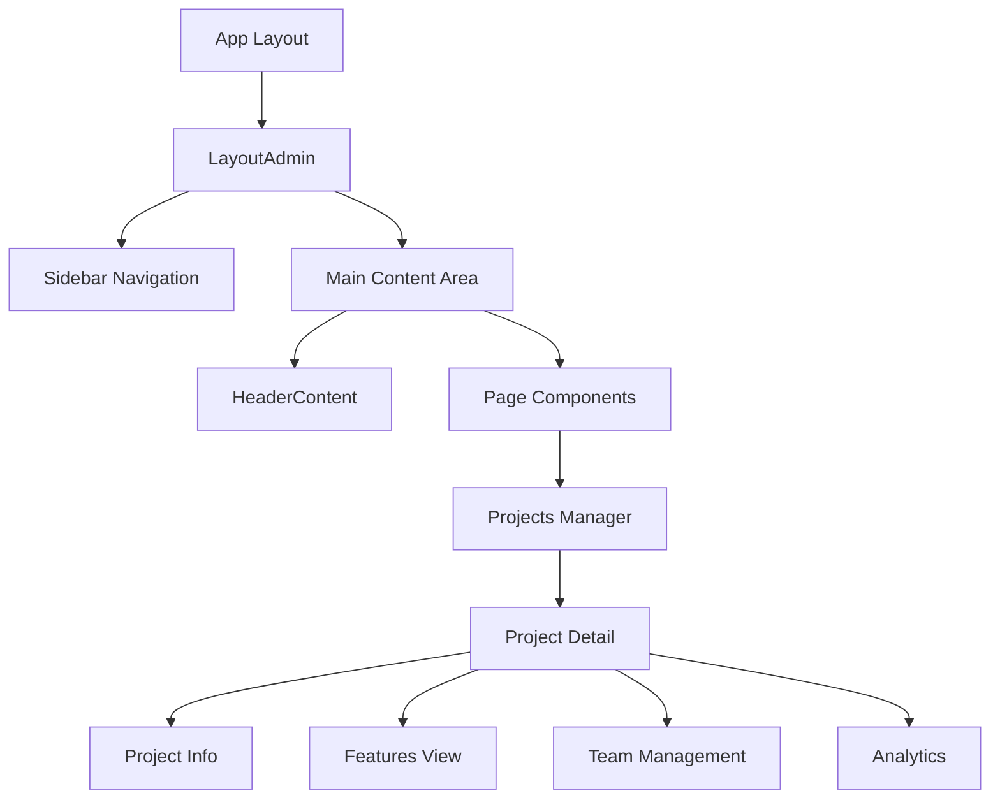
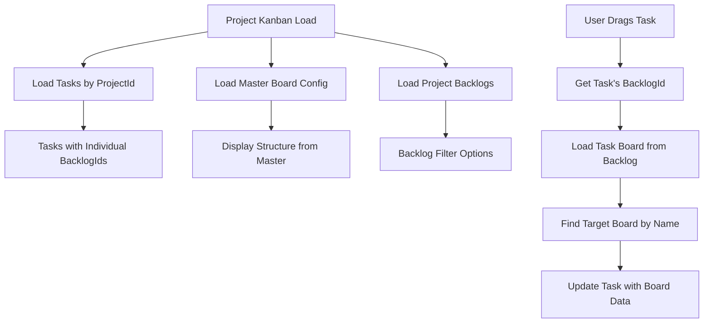

# 🚀 Revo-Kobra App Management Frontend

> **Modern Project & Application Management System**  
> Built with Next.js 15, Chakra UI v2, and TypeScript

[](https://nextjs.org/)
[](https://chakra-ui.com/)
[](https://www.typescriptlang.org/)
[]()

## 📋 Table of Contents

- [🎯 Project Overview](#-project-overview)
- [🏗️ Architecture & Structure](#️-architecture--structure)
- [🚀 Getting Started](#-getting-started)
- [📚 Critical Documentation](#-critical-documentation)
- [🎨 UI/UX System](#-uiux-system)
- [🔧 Development Guide](#-development-guide)
- [📊 API Integration](#-api-integration)
- [🐛 Troubleshooting](#-troubleshooting)
- [📈 Changelog](#-changelog)

---

## 🎯 Project Overview

**Revo-Kobra App Management Frontend** is a comprehensive project and application management system designed for modern development teams. It provides intuitive interfaces for project tracking, team collaboration, and application lifecycle management.

### ✨ Key Features

- **📊 Project Management** - Complete CRUD operations with progress tracking
- **👥 Team Collaboration** - User assignment and role-based access control
- **📱 Application Lifecycle** - App registration, environment management, and deployment tracking
- **📈 Analytics & Reporting** - Real-time dashboards and progress visualization
- **🎨 Modern UI/UX** - Beautiful, responsive design with Chakra UI v2
- **🔐 Authentication** - JWT-based secure authentication system
- **🧩 Reusable Components** - Unified CardProject component with multiple variants
- **🧭 Smart Navigation** - Auto-expanding sidebar with active state detection
- **🌙 Complete Dark Mode** - Full theming support across all components
- **⚡ Performance Optimized** - Direct color mode checking for better performance

### 🛠️ Technology Stack

| Category | Technology | Version |
|----------|------------|---------|
| **Framework** | Next.js | 15.1.5 |
| **UI Library** | Chakra UI | v2.10.5 |
| **Language** | TypeScript | 5.0 |
| **State Management** | React Context + Hooks | - |
| **Forms** | Formik + Yup | Latest |
| **HTTP Client** | Axios | Latest |
| **Icons** | React Icons | Latest |
| **Charts** | ApexCharts | Latest |

---

## 🏗️ Architecture & Structure

### 📁 Directory Structure

```
src/app/
├── (pages)/                    # Next.js Route Groups
│   ├── projects-manager/       # 🎯 Project Management (CORE)
│   │   ├── detail/            # Project Detail Pages
│   │   │   ├── projectManagerDetail.tsx    # Main Detail Component
│   │   │   ├── projectSummary.tsx         # Summary Sidebar
│   │   │   ├── projectFeaturesView.tsx    # Features Management
│   │   │   └── apps/                      # App Management
│   │   └── page.tsx           # Projects List
│   ├── home/                  # Dashboard
│   ├── teams/                 # Team Management
│   ├── users/                 # User Management
│   ├── kanban/                # Kanban Boards
│   ├── calendar/              # Calendar View
│   └── requirements/          # Requirements Management
├── components/                # 🧩 Reusable UI Components
│   ├── layoutAdmin.tsx        # Main Layout
│   ├── sidebar.tsx           # Navigation Sidebar
│   ├── headerContent.tsx     # Page Headers
│   └── tableComponents.tsx   # Data Tables
├── services/                  # 🔌 API Service Hooks
│   ├── useProjects.ts        # Projects API
│   ├── useUsers.ts           # Users API
│   ├── useTasks.ts           # Tasks API
│   └── useAuthentications.ts # Auth API
├── context/                   # 🌐 React Contexts
│   └── AuthContext.tsx       # Authentication Context
├── types/                     # 📝 TypeScript Interfaces
├── constants/                 # ⚙️ Application Constants
├── helper/                    # 🛠️ Utility Functions
└── utils/                     # 🔧 Common Utilities
```

### 🎯 Core Components Architecture



---

## 🚀 Getting Started

### 📋 Prerequisites

- **Node.js** >= 18.0.0
- **npm** >= 9.0.0 or **yarn** >= 1.22.0
- **Git** for version control

### ⚡ Quick Start

```bash
# 1. Clone the repository
git clone <repository-url>
cd app-management-fe

# 2. Install dependencies
npm install

# 3. Set up environment variables
cp .env.example .env.local
# Edit .env.local with your configuration

# 4. Run development server
npm run dev

# 5. Open browser
# Navigate to http://localhost:8998
```

### 🔧 Available Scripts

```bash
# Development
npm run dev          # Start development server on port 8998

# Production
npm run build        # Build for production
npm run start        # Start production server

# Code Quality
npm run lint         # Run ESLint
npm run type-check   # Run TypeScript compiler check
```

---

## 📚 Critical Documentation

> **⚠️ IMPORTANT**: This section contains essential information that must be referenced in every development session.

### 🚨 **CRITICAL IMPLEMENTATION GUIDE (MANDATORY)**

> **⚠️ ABSOLUTE REQUIREMENT**: This process MUST be followed for ALL code implementations. NO EXCEPTIONS.

#### **📋 MANDATORY IMPLEMENTATION PROCESS:**

##### **STEP 1: COMPLETE CODE ANALYSIS (REQUIRED)**
```bash
# ALWAYS do this BEFORE any changes:
1. Read ENTIRE file structure with fs_read
2. Check ALL opening/closing tags: <>, {}, (), []
3. Verify ALL function boundaries and scopes
4. Confirm ALL interface definitions and imports
5. Map ALL variable scopes and dependencies
6. Trace ALL import/export statements
```

##### **STEP 2: CURRENT STATE VERIFICATION (MANDATORY)**
```bash
# MUST verify current situation:
1. fs_read - Check exact line numbers around changes
2. fs_read - Verify existing code structure completely
3. fs_read - Confirm all related interfaces match
4. fs_read - Check import statements are correct
5. fs_read - Validate component boundaries are intact
```

##### **STEP 3: IMPLEMENTATION WITH PRECISION (CRITICAL)**
```bash
# Implementation rules (NO VIOLATIONS):
1. Make MINIMAL changes only - no extra code
2. Preserve ALL existing functionality intact
3. Match EXACT existing code patterns
4. Use EXISTING variable names and conventions
5. Follow CURRENT code style consistently
```

##### **STEP 4: MANDATORY BUILD VERIFICATION (REQUIRED)**
```bash
# AFTER every single change:
cd /path/to/project
./node_modules/.bin/tsc --noEmit --project . 2>&1

# If ANY errors found:
1. Read error messages completely and carefully
2. Check EXACT line numbers mentioned in errors
3. Fix ALL errors before making any other changes
4. Build again until absolutely NO errors remain
5. Repeat process until 100% SUCCESS
```

##### **STEP 5: ITERATIVE ERROR RESOLUTION (PROCESS)**
```bash
# Mandatory process flow:
1. Build → Find and analyze all errors
2. Analyze → Understand complete root cause
3. Fix → Make minimal targeted changes only
4. Build → Verify fix works completely
5. Repeat → Until completely clean build
```

#### **⚠️ CRITICAL VIOLATION RULES:**

##### **❌ NEVER DO (FORBIDDEN):**
- Make changes without reading complete file structure
- Assume code structure without fs_read verification
- Skip build verification after any changes
- Make multiple changes before testing each one
- Ignore or skip TypeScript error details
- Add code without understanding existing patterns
- Remove functionality without explicit instruction

##### **✅ ALWAYS DO (MANDATORY):**
- Read complete file with fs_read before ANY changes
- Verify ALL brackets/tags/parentheses match perfectly
- Check ALL function/component boundaries are correct
- Build after EVERY single change made
- Fix ALL errors before proceeding to next change
- Follow existing code patterns exactly
- Preserve all existing functionality

#### **🔧 MANDATORY IMPLEMENTATION WORKFLOW:**

```bash
SESSION START/RESUME CHECKLIST:
□ 1. fs_read → Complete file analysis first
□ 2. fs_read → Check specific implementation areas
□ 3. fs_read → Verify all interfaces/types exist
□ 4. fs_write → Make single minimal change
□ 5. BUILD → ./node_modules/.bin/tsc --noEmit
□ 6. IF ERRORS → Return to step 1, analyze completely
□ 7. IF SUCCESS → Continue to next minimal change
□ 8. REPEAT → Until all requirements complete
```

#### **📝 SESSION DOCUMENTATION REQUIREMENT:**
```typescript
// EVERY session must start with:
// 1. Read this CRITICAL IMPLEMENTATION GUIDE
// 2. Acknowledge understanding of mandatory process
// 3. Follow workflow exactly as documented
// 4. Build and verify after every change
// 5. Document any deviations with justification
```

---

### 🎯 Core Business Logic

#### **Project Management Workflow**
```typescript
// Project Lifecycle States
NEW → ACTIVE → [ONHOLD] → COMPLETED/INACTIVE

// Critical Data Flow
1. Project Creation → Team Assignment → Feature Planning → Development → Deployment
2. Application Registration → Environment Setup → Deployment Tracking
3. User Assignment → Role Management → Access Control
```

#### **Authentication System**
```typescript
// Auth Flow (CRITICAL - DO NOT MODIFY WITHOUT REVIEW)
localStorage.getItem("authData")     // User data
localStorage.getItem("tokenData")    // JWT token

// Auth Context Pattern (USE EVERYWHERE)
const [DataAuth, setDataAuth] = useState<AuthDataResponse | null>(null);
const [tokenData, setTokenData] = useState<string>("");
```

#### **API Response Pattern (MANDATORY)**
```typescript
// Standard API Response Check
const isErrorResponse = requestData?.statusCode !== RES_CODE_OK;
if (isErrorResponse || !requestData) {
  showToast({
    description: requestData?.message || RES_GENERIC_ERROR_MSG,
    statusToast: "error",
  });
  return;
}
```

### 🎨 UI/UX Standards (CRITICAL)

#### **Component Structure Pattern**
```typescript
// MANDATORY: Every page component must follow this pattern
function ComponentName() {
  // 1. Hooks and State
  const showToast = useToastHelper();
  const { colorMode } = useColorMode();
  
  // 2. Auth Setup (REQUIRED)
  const [DataAuth, setDataAuth] = useState<AuthDataResponse | null>(null);
  const [tokenData, setTokenData] = useState<string>("");
  
  // 3. Data State
  const [Data, setData] = useState<DataType | null>(null);
  const [RefreshData, setRefreshData] = useState<number>(0);
  const [IsLoadingProcess, setIsLoadingProcess] = useState(false);
  
  // 4. Auth Effect (COPY EXACTLY)
  useEffect(() => {
    const storedData = localStorage.getItem("authData");
    const token = localStorage.getItem("tokenData") as string;
    
    if (DataAuth == null && storedData) {
      const StorageAuth: AuthDataModelInterface = JSON.parse(storedData);
      const UserData: AuthDataResponse = StorageAuth.dataLogin as AuthDataResponse;
      setDataAuth(UserData);
    }
    
    if (token) setTokenData(token);
  }, [DataAuth]);
  
  // 5. Data Fetching Effect
  // 6. Render with LayoutAdmin wrapper
}
```

#### **Chakra UI Design System (MANDATORY)**
```typescript
// Color Schemes (USE THESE ONLY)
colorScheme="blue"     // Primary actions, info
colorScheme="green"    // Success, active states
colorScheme="orange"   // Warnings, in-progress
colorScheme="red"      // Errors, inactive states
colorScheme="purple"   // Secondary actions, features
colorScheme="gray"     // Neutral, disabled states

// Spacing System (CONSISTENT)
spacing={4}   // Standard spacing
spacing={6}   // Section spacing
spacing={8}   // Page spacing

// Border Radius (CONSISTENT)
rounded="lg"    // Standard components
rounded="xl"    // Cards and containers
rounded="2xl"   // Headers and special elements
rounded="full"  // Buttons and badges
```

### 🔧 Development Patterns (CRITICAL)

#### **Color Mode Pattern (UPDATED - December 2024)**
```typescript
// PREFERRED: Direct color mode checking (Better Performance)
const { colorMode } = useColorMode();

// Usage in components
bg={colorMode === "light" ? "white" : "gray.800"}
borderColor={colorMode === "light" ? "gray.200" : "gray.700"}
color={colorMode === "light" ? "gray.800" : "white"}

// Benefits:
// - Better performance (no hook overhead)
// - More explicit and readable
// - Easier debugging
// - Consistent with codebase patterns

// AVOID: useColorModeValue (Legacy approach)
// bg={useColorModeValue("white", "gray.800")} // ❌ Don't use
```

#### **Error Handling Pattern (MANDATORY)**
```typescript
// ALWAYS use this pattern for API calls
try {
  setIsLoadingProcess(true);
  const requestData = await APICall(params, tokenData);
  
  if (!requestData || requestData.statusCode !== RES_CODE_OK) {
    showToast({
      description: requestData?.message || RES_GENERIC_ERROR_MSG,
      statusToast: "error",
    });
    return;
  }
  
  // Success handling
  const data = requestData.data as DataType;
  setData(data);
  
} catch (error) {
  console.error("Error:", error);
  showToast({
    description: "An unexpected error occurred",
    statusToast: "error",
  });
} finally {
  setIsLoadingProcess(false);
}
```

#### **Sidebar Navigation Pattern (NEW - December 2024)**
```typescript
// Smart submenu expansion with active detection
const [isOpen, setIsOpen] = useState(false);
const [hasActiveChild, setHasActiveChild] = useState(false);

// Auto-expand logic
useEffect(() => {
  const currentPath = pathname;
  
  // Check if current item is active
  const isCurrentActive = currentPath === data.link && data.children.length <= 0;
  setIsActiveNav(isCurrentActive);
  
  // Check if any child is active (recursive)
  const checkActiveChild = (children: LinkItemProps[]): boolean => {
    return children.some(child => {
      if (currentPath === child.link) return true;
      if (child.children && child.children.length > 0) {
        return checkActiveChild(child.children);
      }
      return false;
    });
  };
  
  const childActive = hasChildren && checkActiveChild(data.children);
  setHasActiveChild(childActive);
  
  // Auto-expand if current item or child is active
  if (isCurrentActive || childActive) {
    setIsOpen(true);
  }
}, [pathname, hasChildren, data.children, data.link]);

// Visual states
bgGradient={
  IsActiveNav
    ? "linear(to-r, secondary.500, secondary.600)"    // Active item
    : hasActiveChild
    ? "linear(to-r, secondary.100, secondary.200)"    // Has active child
    : "linear(to-r, transparent, transparent)"        // Default
}
```

#### **Form Handling Pattern (MANDATORY)**
```typescript
// Formik + Yup Pattern (USE EVERYWHERE)
const formik = useFormik<PayloadType>({
  initialValues: initialValues,
  validationSchema: ValidationSchema,
  validateOnChange: false,
  validateOnBlur: false,
  onSubmit: async (values) => {
    await handleSubmit(values);
  },
});

// Validation Schema Pattern
const ValidationSchema = Yup.object().shape({
  field: Yup.string()
    .required("Field is required")
    .min(3, "Minimum 3 characters")
    .max(100, "Maximum 100 characters"),
});
```

### 📊 Data Management (CRITICAL)

#### **State Management Pattern**
```typescript
// Refresh Pattern (USE EVERYWHERE)
const [RefreshData, setRefreshData] = useState<number>(0);
const refreshAction = () => setRefreshData(prev => prev + 1);

// Loading Pattern (MANDATORY)
const [IsLoadingProcess, setIsLoadingProcess] = useState(false);
const [ActionLoading, setActionLoading] = useState(false);
```

#### **Color Mode Pattern (UPDATED - DECEMBER 2024)**
```typescript
// PREFERRED: Direct color mode checking (Better Performance)
const { colorMode } = useColorMode();
bg={colorMode === "light" ? "white" : "gray.800"}
borderColor={colorMode === "light" ? "gray.200" : "gray.700"}
color={colorMode === "light" ? "gray.800" : "white"}

// AVOID: useColorModeValue (Legacy approach)
// bg={useColorModeValue("white", "gray.800")} // ❌ Don't use
```

#### **TypeScript Interfaces (CRITICAL)**
```typescript
// Project Data Structure (CORE)
interface ProjectDataResponse {
  id: string;
  projectNo: string;
  projectName: string;
  projectDesc: string | null;
  projectStatus: string;
  projectStatusPercentage: number;
  projectType: string;
  projectCategory: string;
  userAssignment: ProjectUserAssignmentResponse[];
  appsProject?: AppsResponse; // Application data
}

// Auth Data Structure (CRITICAL)
interface AuthDataResponse {
  id: string;
  nama: string;
  email: string;
  team: TeamData;
  // ... other fields
}
```

---

## 🎨 UI/UX System

### 🌈 Current Design Implementation

The application features a **modern, gradient-based design system** with the following characteristics:

#### **🎯 Project Detail Page (Main Feature)**

**Header Design:**
- **Gradient Background**: `linear(135deg, blue.500, purple.600, pink.500)`
- **Application Avatar**: First letter of app name with gradient background
- **Project Information**: Name, status badges, progress indicators
- **Action Buttons**: Back, Favorite, Share, Refresh with hover effects

**Tab System:**
- **5 Comprehensive Tabs**: Overview, Details, Features, Team, Analytics
- **Enclosed Variant**: Modern styling with proper selected states
- **Icon Integration**: Feather icons with text labels
- **Responsive Design**: Adapts to all screen sizes

**Layout Structure:**
```typescript
// Desktop Layout
<Grid templateColumns={{ base: "1fr", lg: "1fr 300px" }} gap={6}>
  <GridItem>Main Content with Tabs</GridItem>
  <GridItem>Sidebar with Quick Info</GridItem>
</Grid>

// Mobile Layout: Single column, stacked
```

### 🎨 Component Library

#### **Reusable CardProject Component (NEW - December 2024)**
```typescript
// Unified card component with variants
<CardProject
  data={projectData}
  variant="manager"           // or "development"
  linkPath="/custom/path"     // optional custom link
  actionLabel="Custom Action" // optional custom button text
  actionIcon={FiTarget}       // optional custom icon
/>

// Manager variant (blue theme)
<CardProject data={projectData} variant="manager" />
// Links to: projects-manager/detail
// Button: "Manage Project" with Settings icon

// Development variant (secondary theme)  
<CardProject data={projectData} variant="development" />
// Links to: project-development/development
// Button: "Start Development" with Code icon
```

#### **Cards and Containers**
```typescript
<Card shadow="sm" rounded="lg">           // Standard cards
<Card shadow="xl" rounded="2xl">          // Prominent cards
<Box bgGradient="linear(...)">            // Gradient containers
```

#### **Buttons and Actions**
```typescript
<Button colorScheme="blue" rounded="full">     // Primary actions
<Button variant="ghost" rounded="full">        // Secondary actions
<Button leftIcon={<Icon />}>                   // Icon buttons
```

#### **Status Indicators**
```typescript
<Badge colorScheme="green">ACTIVE</Badge>      // Success states
<Badge colorScheme="orange">ONHOLD</Badge>     // Warning states
<Badge colorScheme="red">INACTIVE</Badge>      // Error states
```

---

## 🔧 Development Guide

### 🚀 Adding New Features

#### **1. Create New Page Component**
```typescript
// Follow the critical component pattern above
// Always include auth setup, error handling, and loading states
```

#### **2. Add API Service**
```typescript
// Create custom hook in services/
export const useNewService = () => {
  const apiCall = async (data: PayloadType, token: string) => {
    // Implementation
  };
  
  return { apiCall };
};
```

#### **3. Update Navigation**
```typescript
// Add to sidebar.tsx navigation items
// Update breadcrumb in headerContent
```

### 🎨 UI Component Development

#### **Creating New Components**
```typescript
// Always use TypeScript interfaces
interface ComponentProps {
  data: DataType;
  onAction: () => void;
}

// Follow Chakra UI patterns
const Component = ({ data, onAction }: ComponentProps) => {
  return (
    <Card>
      <CardBody>
        {/* Component content */}
      </CardBody>
    </Card>
  );
};
```

### 📊 Data Integration

#### **API Integration Pattern**
```typescript
// Use existing service hooks
const { GetData, UpdateData, DeleteData } = useServiceHook();

// Follow error handling pattern
// Implement loading states
// Use toast notifications
```

---

## 📊 API Integration

### 🔌 Service Architecture

The application uses **custom React hooks** for API integration:

```typescript
// Service Hook Pattern
export const useServiceName = () => {
  const apiMethod = async (payload: PayloadType, token: string) => {
    try {
      const response = await axiosInstance.post('/endpoint', payload, {
        headers: { Authorization: `Bearer ${token}` }
      });
      return response.data;
    } catch (error) {
      return handleAxiosError(error);
    }
  };
  
  return { apiMethod };
};
```

### 📡 Available Services

| Service | Hook | Purpose |
|---------|------|---------|
| **Projects** | `useProjects()` | Project CRUD operations |
| **Users** | `useUsers()` | User management |
| **Tasks** | `useTasks()` | Task management |
| **Teams** | `useTeams()` | Team operations |
| **Auth** | `useAuthentications()` | Authentication |
| **Apps** | `useApps()` | Application management |

---

## 🐛 Troubleshooting

### ⚠️ Common Issues & Solutions

#### **TypeScript Errors**
```bash
# Issue: Property does not exist
# Solution: Check interface definitions in types/
# Always use optional chaining: data?.property
```

#### **API Response Errors**
```typescript
// Issue: API calls failing
// Solution: Check response structure
if (!requestData || requestData.statusCode !== RES_CODE_OK) {
  // Handle error
}
```

#### **Authentication Issues**
```typescript
// Issue: Auth data not loading
// Solution: Check localStorage and token
const storedData = localStorage.getItem("authData");
const token = localStorage.getItem("tokenData");
```

#### **UI Layout Issues**
```typescript
// Issue: Responsive layout breaking
// Solution: Use Chakra UI responsive props
<Grid templateColumns={{ base: "1fr", lg: "1fr 300px" }}>
```

---

## 📈 Changelog

### 🎯 Major Milestones

#### **v2.1.0 - UI/UX Enhancement & Code Quality** *(December 2024)*
- ✅ **Reusable CardProject Component** - Unified card system with manager/development variants
- ✅ **Smart Sidebar Navigation** - Auto-expanding submenus with active state detection
- ✅ **Complete Dark Mode Support** - Full ProjectManagerDetail component theming
- ✅ **Performance Optimization** - Replaced useColorModeValue with direct colorMode checking
- ✅ **TypeScript Error Resolution** - Fixed syntax errors and improved code quality
- ✅ **Avatar Size Optimization** - Improved visual balance in card layouts
- ✅ **Enhanced Navigation UX** - Better visual feedback and state management

#### **v2.0.0 - Modern UI Enhancement** *(August 2024)*
- ✅ **Complete UI redesign** with Chakra UI v2
- ✅ **Gradient-based design system** implementation
- ✅ **Application-focused project detail** page
- ✅ **5-tab comprehensive interface** (Overview, Details, Features, Team, Analytics)
- ✅ **Responsive design** for all screen sizes
- ✅ **TypeScript error resolution** - clean compilation

#### **v1.5.0 - Core Functionality** *(July 2024)*
- ✅ **Project management** CRUD operations
- ✅ **Team assignment** and management
- ✅ **Authentication system** with JWT
- ✅ **API integration** with custom hooks

#### **v1.0.0 - Initial Release** *(February 2024)*
- ✅ **Next.js 15** setup with App Router
- ✅ **Chakra UI** integration
- ✅ **TypeScript** configuration
- ✅ **Basic project structure**

### 🔄 Recent Updates (December 2024)

#### **🎨 Component Improvements**
- **CardProject Unification** - Single reusable component for all project cards
- **Avatar Size Fixes** - Optimized xs size for better visual balance
- **Variant System** - Support for manager and development card variants
- **Custom Props** - Flexible linkPath, actionLabel, and actionIcon configuration

#### **🧭 Navigation Enhancements**
- **Smart Submenu Expansion** - Auto-opens when child routes are active
- **Visual State Indicators** - Clear feedback for active parents and children
- **Recursive Active Detection** - Works with deeply nested menu structures
- **Improved UX** - Consistent navigation state across route changes

#### **🌙 Dark Mode Completion**
- **Full Component Coverage** - All ProjectManagerDetail elements properly themed
- **Performance Optimization** - Direct colorMode checking instead of hooks
- **Consistent Patterns** - Unified approach across the entire component
- **Better Maintainability** - Easier to debug and modify color schemes

#### **🔧 Code Quality**
- **TypeScript Fixes** - Resolved syntax errors and missing braces
- **Performance Patterns** - Optimized color mode checking approach
- **Documentation Updates** - Comprehensive pattern documentation
- **Best Practices** - Consistent coding standards implementation

### 🔄 Recent Updates

- **Application Avatar Implementation** - Shows app name instead of project name
- **Enhanced Header Design** - Gradient backgrounds with modern styling
- **Comprehensive Tab System** - Rich content in all tabs
- **Error Handling Improvements** - Better TypeScript compliance
- **Documentation Centralization** - Single source of truth

---

## 📞 Support & Contact

For development questions or issues:

1. **Check this documentation first** - Most answers are here
2. **Review the troubleshooting section** - Common issues covered
3. **Check existing code patterns** - Follow established conventions
4. **Update this documentation** - Keep it current with changes

---

**📝 Last Updated**: December 2024  
**🔄 Documentation Version**: 2.1.0  
**👨‍💻 Maintained by**: Development Team

---

## 🎯 **Project Kanban System (December 2024)**

### ✨ **Overview**
The Project Kanban is a specialized kanban board that displays tasks filtered by project ID only, with dynamic task board configuration loading based on each task's individual backlog relationship. Features modern UI design, comprehensive filtering, and real-time task management.

### 🏗️ **Architecture**

#### **Key Differences from General Kanban:**
```typescript
// General Kanban (/kanban)
- Requires: projectId + backlogId in URL
- API: v1/Task/list-task-board?backlogId=specific_backlog
- Scope: Tasks from single backlog only

// Project Kanban (/project-development/development/kanban)  
- Requires: projectId only in URL
- API: v1/Task/paged-list (filtered by projectId)
- Scope: All tasks in project (mixed backlogs supported)
```

#### **Data Flow:**


### 🎯 **Implementation Details**

#### **✅ 1. Task Loading & Filtering:**
```typescript
// Load all project tasks (mixed backlogs)
const PayloadList: PaggingListPayloadCustom = {
  filterWhere: [{ field: "projectId", operator: "=", value: projectId }]
};

// Backlog filtering
const PayloadBacklogs: PaggingListPayload = {
  filterWhere: [{ field: "reqId", operator: "=", value: DataProject.reqParentId }]
};

// Apply filters
if (filterBacklog) {
  filteredTasks = filteredTasks.filter(task => task.backlogId === filterBacklog);
}
```

#### **✅ 2. Modern Task Card Design:**
```typescript
// Enhanced task card with modern UI
- Priority color bar at top
- Task ID display (#abc123)
- Backlog reference with icon
- Progress bar with percentage
- Due date indicators
- Enhanced avatars and metadata
- Smooth hover animations
- Dark mode support
```

#### **✅ 3. Dynamic Task Movement:**
```typescript
const handleTaskDrop = async (taskId: string, targetBoardName: string) => {
  // 1. Get task being moved
  const taskToMove = DataTasks.find(task => task.id === taskId);
  
  // 2. Load task board config from task's backlog
  const taskBoards = await ListTasksBoard(taskToMove.backlogId, tokenData);
  
  // 3. Find target board by name matching
  const targetBoard = taskBoards.find(board => board.boardName === targetBoardName);
  
  // 4. Update task with complete board data
  const payload: TaskMovePayload = {
    id: taskId,
    boardId: targetBoard.id,
    boardCodeStage: targetBoard.boardCodeStage,
    boardName: targetBoard.boardName,
    backlogId: taskToMove.backlogId,
  };
};
```

#### **✅ 4. Task Creation with Backlog Selection:**
```typescript
// Required backlog selection for new tasks
if (!selectedTask && !taskForm.backlogId) {
  showToast({
    description: "Please select a backlog for the task",
    statusToast: "error",
  });
  return;
}

// Create task with backlog reference
const payload: CreateSimpleTaskPayload = {
  taskName: taskForm.taskName,
  boardId: selectedBoardId,
  projectId: projectId!,
  backlogId: taskForm.backlogId, // Required
};
```

### 🎯 **Key Features**

#### **✅ Advanced Filtering System:**
- **Search Tasks** - By name and description
- **Priority Filter** - High, Medium, Low priority levels
- **Backlog Filter** - Filter by specific project backlogs
- **Completed Tasks** - Toggle to show/hide completed tasks
- **Real-time Updates** - Filters apply instantly

#### **✅ Modern Task Cards:**
- **Priority Color Bar** - Visual priority indication
- **Task Metadata** - ID, backlog, progress, dates
- **Enhanced Progress** - Visual progress bar with percentage
- **User Assignments** - Overlapping avatars with tooltips
- **Hover Effects** - Smooth animations and shadows
- **Dark Mode Support** - Complete theming compatibility

#### **✅ Comprehensive Task Management:**
- **Drag & Drop** - Move tasks between boards
- **Board Selector** - Click to move tasks in detail modal
- **Task Items** - Checklist management with progress tracking
- **Comments System** - Add, edit, delete comments with pagination
- **User Assignment** - Search and assign users to tasks
- **Date Management** - Start and due date selection
- **Real-time Refresh** - Auto-refresh on all operations

#### **✅ Task Detail Modal:**
- **Inline Editing** - Edit task name and description directly
- **Board Selection** - Dynamic board options from task's backlog
- **Backlog Information** - Highlighted backlog display
- **Progress Tracking** - Automatic progress calculation
- **Activity Timeline** - Comments and updates history
- **User Management** - Assign/unassign team members

### 🎯 **API Integration**

#### **Required APIs:**
```typescript
// Task management
v1/Task/paged-list (with projectId filter)
v1/Task/move-task (with complete board data)
v1/Task/create-simple (with backlog selection)

// Board configuration  
v1/MasterBoardTask/list (with isDisplay = "Y" filter)
v1/Task/list-task-board?backlogId=${task.backlogId}

// Backlog management
v1/Requirement/backlog/list (with reqId filter)

// User management
v1/User/list (for task assignment)
```

#### **API Response Formats:**
```typescript
// Task list response
{ statusCode: 200, data: TaskViewModel[] }

// Backlog response  
{ statusCode: 200, data: BacklogDataResponse[] }

// Task board response (on move)
{ statusCode: 200, data: TaskBoardViewModel[] }
```

### 🎯 **Usage**

#### **URL Structure:**
```typescript
// Access project kanban
/project-development/development/kanban?projectId=123

// Auto-navigation from project detail
<Link href={`/project-development/development/kanban?projectId=${projectId}`}>
  <Button>Project Kanban</Button>
</Link>
```

#### **File Structure:**
```
project-development/development/kanban/
├── page.tsx                    # Route wrapper with Suspense
└── projectKanbanView.tsx       # Main kanban implementation
```

### 🎯 **Benefits**

✅ **Flexible Task Management** - Handle tasks from multiple backlogs  
✅ **Modern UI/UX** - Beautiful, responsive design with animations  
✅ **Dynamic Configuration** - Board setup loaded per task's backlog  
✅ **Comprehensive Filtering** - Multiple filter options for task organization  
✅ **Real-time Updates** - Instant refresh on all operations  
✅ **Dark Mode Support** - Complete theming across all components  
✅ **Performance Optimized** - Efficient data loading and caching  
✅ **User Friendly** - Intuitive interface with helpful feedback  

### ⚠️ **Important Notes**

#### **Board Data Consistency:**
- Tasks must have valid `backlogId` for movement to work
- Board names must match between master and backlog configurations
- Task movement updates: `boardId`, `boardCodeStage`, `boardName`
- Backlog selection is mandatory for new task creation

#### **Error Handling:**
- Validates task existence before movement
- Checks backlog board configuration availability  
- Provides detailed error messages for debugging
- Console logging for development troubleshooting
- Toast notifications for user feedback

#### **Performance Considerations:**
- Tasks auto-refresh on all CRUD operations
- Efficient filtering with client-side processing
- Optimized API calls with proper caching
- Smooth animations without performance impact

---

> **⚠️ IMPORTANT**: Always update this centralized documentation instead of creating new files. This is the single source of truth for the project.

### 🎯 **Recent Session Improvements (December 2024)**

#### **✅ Components Enhanced:**
- **CardProject** - Unified reusable component with variants
- **Sidebar Navigation** - Smart submenu expansion with active detection
- **ProjectManagerDetail** - Complete dark mode support with direct color checking
- **Project Kanban** - MAJOR UPDATE: Complete kanban system with advanced features
- **TaskCard** - Modern UI redesign with enhanced information display
- **TypeScript** - Fixed syntax errors and improved code quality

#### **✅ NEW: Advanced Project Kanban Features:**
- **Backlog Filtering** - Filter tasks by specific project backlogs
- **Modern Task Cards** - Beautiful UI with priority bars, progress indicators, and metadata
- **Task Detail Modal** - Comprehensive task management with inline editing
- **Board Selector** - Dynamic board options loaded from task's backlog
- **Real-time Refresh** - Auto-refresh on all task operations
- **Dark Mode Support** - Complete theming for kanban headers and components
- **Required Backlog Selection** - Mandatory backlog assignment for new tasks

#### **✅ Performance Optimizations:**
- **Color Mode Checking** - Replaced useColorModeValue with direct colorMode checking
- **Avatar Sizing** - Optimized xs size for better visual balance
- **Navigation State** - Improved active state detection and visual feedback
- **Dynamic Board Loading** - Efficient task board configuration loading
- **Task Data Refresh** - Automatic refresh on task item and comment operations

#### **✅ Code Quality:**
- **Consistent Patterns** - Unified approach across components
- **Better Maintainability** - Easier debugging and modification
- **Documentation Updates** - Comprehensive pattern documentation
- **Best Practices** - Following established coding standards
- **TypeScript Safety** - Proper type checking and error handling

#### **✅ UI/UX Enhancements:**
- **Task Card Redesign** - Modern cards with priority color bars and enhanced metadata
- **Hover Animations** - Smooth lift effects and shadow transitions
- **Information Labels** - Task ID, backlog reference, due dates, progress indicators
- **Backlog Highlighting** - Important backlog information with blue highlight box
- **Rounded Styling** - Consistent radiusStyle usage throughout kanban boards
