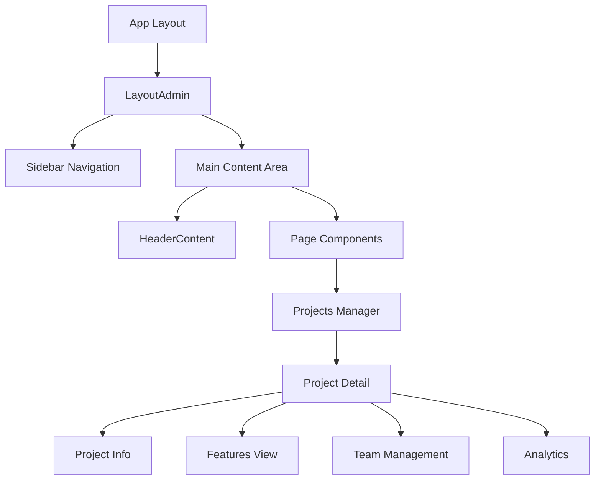

# 🚀 Revo-Kobra App Management Frontend

> **Modern Project & Application Management System**  
> Built with Next.js 15, Chakra UI v2, and TypeScript

[](https://nextjs.org/)
[](https://chakra-ui.com/)
[](https://www.typescriptlang.org/)
[]()

## 📋 Table of Contents

- [🎯 Project Overview](#-project-overview)
- [🏗️ Architecture & Structure](#️-architecture--structure)
- [🚀 Getting Started](#-getting-started)
- [📚 Critical Documentation](#-critical-documentation)
- [🎨 UI/UX System](#-uiux-system)
- [🔧 Development Guide](#-development-guide)
- [📊 API Integration](#-api-integration)
- [🐛 Troubleshooting](#-troubleshooting)
- [📈 Changelog](#-changelog)

---

## 🎯 Project Overview

**Revo-Kobra App Management Frontend** is a comprehensive project and application management system designed for modern development teams. It provides intuitive interfaces for project tracking, team collaboration, and application lifecycle management.

### ✨ Key Features

- **📊 Project Management** - Complete CRUD operations with progress tracking
- **👥 Team Collaboration** - User assignment and role-based access control
- **📱 Application Lifecycle** - App registration, environment management, and deployment tracking
- **📈 Analytics & Reporting** - Real-time dashboards and progress visualization
- **🎨 Modern UI/UX** - Beautiful, responsive design with Chakra UI v2
- **🔐 Authentication** - JWT-based secure authentication system

### 🛠️ Technology Stack

| Category | Technology | Version |
|----------|------------|---------|
| **Framework** | Next.js | 15.1.5 |
| **UI Library** | Chakra UI | v2.10.5 |
| **Language** | TypeScript | 5.0 |
| **State Management** | React Context + Hooks | - |
| **Forms** | Formik + Yup | Latest |
| **HTTP Client** | Axios | Latest |
| **Icons** | React Icons | Latest |
| **Charts** | ApexCharts | Latest |

---

## 🏗️ Architecture & Structure

### 📁 Directory Structure

```
src/app/
├── (pages)/                    # Next.js Route Groups
│   ├── projects-manager/       # 🎯 Project Management (CORE)
│   │   ├── detail/            # Project Detail Pages
│   │   │   ├── projectManagerDetail.tsx    # Main Detail Component
│   │   │   ├── projectSummary.tsx         # Summary Sidebar
│   │   │   ├── projectFeaturesView.tsx    # Features Management
│   │   │   └── apps/                      # App Management
│   │   └── page.tsx           # Projects List
│   ├── home/                  # Dashboard
│   ├── teams/                 # Team Management
│   ├── users/                 # User Management
│   ├── kanban/                # Kanban Boards
│   ├── calendar/              # Calendar View
│   └── requirements/          # Requirements Management
├── components/                # 🧩 Reusable UI Components
│   ├── layoutAdmin.tsx        # Main Layout
│   ├── sidebar.tsx           # Navigation Sidebar
│   ├── headerContent.tsx     # Page Headers
│   └── tableComponents.tsx   # Data Tables
├── services/                  # 🔌 API Service Hooks
│   ├── useProjects.ts        # Projects API
│   ├── useUsers.ts           # Users API
│   ├── useTasks.ts           # Tasks API
│   └── useAuthentications.ts # Auth API
├── context/                   # 🌐 React Contexts
│   └── AuthContext.tsx       # Authentication Context
├── types/                     # 📝 TypeScript Interfaces
├── constants/                 # ⚙️ Application Constants
├── helper/                    # 🛠️ Utility Functions
└── utils/                     # 🔧 Common Utilities
```

### 🎯 Core Components Architecture



---

## 🚀 Getting Started

### 📋 Prerequisites

- **Node.js** >= 18.0.0
- **npm** >= 9.0.0 or **yarn** >= 1.22.0
- **Git** for version control

### ⚡ Quick Start

```bash
# 1. Clone the repository
git clone <repository-url>
cd app-management-fe

# 2. Install dependencies
npm install

# 3. Set up environment variables
cp .env.example .env.local
# Edit .env.local with your configuration

# 4. Run development server
npm run dev

# 5. Open browser
# Navigate to http://localhost:8998
```

### 🔧 Available Scripts

```bash
# Development
npm run dev          # Start development server on port 8998

# Production
npm run build        # Build for production
npm run start        # Start production server

# Code Quality
npm run lint         # Run ESLint
npm run type-check   # Run TypeScript compiler check
```

---

## 📚 Critical Documentation

> **⚠️ IMPORTANT**: This section contains essential information that must be referenced in every development session.

### 🎯 Core Business Logic

#### **Project Management Workflow**
```typescript
// Project Lifecycle States
NEW → ACTIVE → [ONHOLD] → COMPLETED/INACTIVE

// Critical Data Flow
1. Project Creation → Team Assignment → Feature Planning → Development → Deployment
2. Application Registration → Environment Setup → Deployment Tracking
3. User Assignment → Role Management → Access Control
```

#### **Authentication System**
```typescript
// Auth Flow (CRITICAL - DO NOT MODIFY WITHOUT REVIEW)
localStorage.getItem("authData")     // User data
localStorage.getItem("tokenData")    // JWT token

// Auth Context Pattern (USE EVERYWHERE)
const [DataAuth, setDataAuth] = useState<AuthDataResponse | null>(null);
const [tokenData, setTokenData] = useState<string>("");
```

#### **API Response Pattern (MANDATORY)**
```typescript
// Standard API Response Check
const isErrorResponse = requestData?.statusCode !== RES_CODE_OK;
if (isErrorResponse || !requestData) {
  showToast({
    description: requestData?.message || RES_GENERIC_ERROR_MSG,
    statusToast: "error",
  });
  return;
}
```

### 🎨 UI/UX Standards (CRITICAL)

#### **Component Structure Pattern**
```typescript
// MANDATORY: Every page component must follow this pattern
function ComponentName() {
  // 1. Hooks and State
  const showToast = useToastHelper();
  const { colorMode } = useColorMode();
  
  // 2. Auth Setup (REQUIRED)
  const [DataAuth, setDataAuth] = useState<AuthDataResponse | null>(null);
  const [tokenData, setTokenData] = useState<string>("");
  
  // 3. Data State
  const [Data, setData] = useState<DataType | null>(null);
  const [RefreshData, setRefreshData] = useState<number>(0);
  const [IsLoadingProcess, setIsLoadingProcess] = useState(false);
  
  // 4. Auth Effect (COPY EXACTLY)
  useEffect(() => {
    const storedData = localStorage.getItem("authData");
    const token = localStorage.getItem("tokenData") as string;
    
    if (DataAuth == null && storedData) {
      const StorageAuth: AuthDataModelInterface = JSON.parse(storedData);
      const UserData: AuthDataResponse = StorageAuth.dataLogin as AuthDataResponse;
      setDataAuth(UserData);
    }
    
    if (token) setTokenData(token);
  }, [DataAuth]);
  
  // 5. Data Fetching Effect
  // 6. Render with LayoutAdmin wrapper
}
```

#### **Chakra UI Design System (MANDATORY)**
```typescript
// Color Schemes (USE THESE ONLY)
colorScheme="blue"     // Primary actions, info
colorScheme="green"    // Success, active states
colorScheme="orange"   // Warnings, in-progress
colorScheme="red"      // Errors, inactive states
colorScheme="purple"   // Secondary actions, features
colorScheme="gray"     // Neutral, disabled states

// Spacing System (CONSISTENT)
spacing={4}   // Standard spacing
spacing={6}   // Section spacing
spacing={8}   // Page spacing

// Border Radius (CONSISTENT)
rounded="lg"    // Standard components
rounded="xl"    // Cards and containers
rounded="2xl"   // Headers and special elements
rounded="full"  // Buttons and badges
```

### 🔧 Development Patterns (CRITICAL)

#### **Error Handling Pattern (MANDATORY)**
```typescript
// ALWAYS use this pattern for API calls
try {
  setIsLoadingProcess(true);
  const requestData = await APICall(params, tokenData);
  
  if (!requestData || requestData.statusCode !== RES_CODE_OK) {
    showToast({
      description: requestData?.message || RES_GENERIC_ERROR_MSG,
      statusToast: "error",
    });
    return;
  }
  
  // Success handling
  const data = requestData.data as DataType;
  setData(data);
  
} catch (error) {
  console.error("Error:", error);
  showToast({
    description: "An unexpected error occurred",
    statusToast: "error",
  });
} finally {
  setIsLoadingProcess(false);
}
```

#### **Form Handling Pattern (MANDATORY)**
```typescript
// Formik + Yup Pattern (USE EVERYWHERE)
const formik = useFormik<PayloadType>({
  initialValues: initialValues,
  validationSchema: ValidationSchema,
  validateOnChange: false,
  validateOnBlur: false,
  onSubmit: async (values) => {
    await handleSubmit(values);
  },
});

// Validation Schema Pattern
const ValidationSchema = Yup.object().shape({
  field: Yup.string()
    .required("Field is required")
    .min(3, "Minimum 3 characters")
    .max(100, "Maximum 100 characters"),
});
```

### 📊 Data Management (CRITICAL)

#### **State Management Pattern**
```typescript
// Refresh Pattern (USE EVERYWHERE)
const [RefreshData, setRefreshData] = useState<number>(0);
const refreshAction = () => setRefreshData(prev => prev + 1);

// Loading Pattern (MANDATORY)
const [IsLoadingProcess, setIsLoadingProcess] = useState(false);
const [ActionLoading, setActionLoading] = useState(false);
```

#### **TypeScript Interfaces (CRITICAL)**
```typescript
// Project Data Structure (CORE)
interface ProjectDataResponse {
  id: string;
  projectNo: string;
  projectName: string;
  projectDesc: string | null;
  projectStatus: string;
  projectStatusPercentage: number;
  projectType: string;
  projectCategory: string;
  userAssignment: ProjectUserAssignmentResponse[];
  appsProject?: AppsResponse; // Application data
}

// Auth Data Structure (CRITICAL)
interface AuthDataResponse {
  id: string;
  nama: string;
  email: string;
  team: TeamData;
  // ... other fields
}
```

---

## 🎨 UI/UX System

### 🌈 Current Design Implementation

The application features a **modern, gradient-based design system** with the following characteristics:

#### **🎯 Project Detail Page (Main Feature)**

**Header Design:**
- **Gradient Background**: `linear(135deg, blue.500, purple.600, pink.500)`
- **Application Avatar**: First letter of app name with gradient background
- **Project Information**: Name, status badges, progress indicators
- **Action Buttons**: Back, Favorite, Share, Refresh with hover effects

**Tab System:**
- **5 Comprehensive Tabs**: Overview, Details, Features, Team, Analytics
- **Enclosed Variant**: Modern styling with proper selected states
- **Icon Integration**: Feather icons with text labels
- **Responsive Design**: Adapts to all screen sizes

**Layout Structure:**
```typescript
// Desktop Layout
<Grid templateColumns={{ base: "1fr", lg: "1fr 300px" }} gap={6}>
  <GridItem>Main Content with Tabs</GridItem>
  <GridItem>Sidebar with Quick Info</GridItem>
</Grid>

// Mobile Layout: Single column, stacked
```

### 🎨 Component Library

#### **Cards and Containers**
```typescript
<Card shadow="sm" rounded="lg">           // Standard cards
<Card shadow="xl" rounded="2xl">          // Prominent cards
<Box bgGradient="linear(...)">            // Gradient containers
```

#### **Buttons and Actions**
```typescript
<Button colorScheme="blue" rounded="full">     // Primary actions
<Button variant="ghost" rounded="full">        // Secondary actions
<Button leftIcon={<Icon />}>                   // Icon buttons
```

#### **Status Indicators**
```typescript
<Badge colorScheme="green">ACTIVE</Badge>      // Success states
<Badge colorScheme="orange">ONHOLD</Badge>     // Warning states
<Badge colorScheme="red">INACTIVE</Badge>      // Error states
```

---

## 🔧 Development Guide

### 🚀 Adding New Features

#### **1. Create New Page Component**
```typescript
// Follow the critical component pattern above
// Always include auth setup, error handling, and loading states
```

#### **2. Add API Service**
```typescript
// Create custom hook in services/
export const useNewService = () => {
  const apiCall = async (data: PayloadType, token: string) => {
    // Implementation
  };
  
  return { apiCall };
};
```

#### **3. Update Navigation**
```typescript
// Add to sidebar.tsx navigation items
// Update breadcrumb in headerContent
```

### 🎨 UI Component Development

#### **Creating New Components**
```typescript
// Always use TypeScript interfaces
interface ComponentProps {
  data: DataType;
  onAction: () => void;
}

// Follow Chakra UI patterns
const Component = ({ data, onAction }: ComponentProps) => {
  return (
    <Card>
      <CardBody>
        {/* Component content */}
      </CardBody>
    </Card>
  );
};
```

### 📊 Data Integration

#### **API Integration Pattern**
```typescript
// Use existing service hooks
const { GetData, UpdateData, DeleteData } = useServiceHook();

// Follow error handling pattern
// Implement loading states
// Use toast notifications
```

---

## 📊 API Integration

### 🔌 Service Architecture

The application uses **custom React hooks** for API integration:

```typescript
// Service Hook Pattern
export const useServiceName = () => {
  const apiMethod = async (payload: PayloadType, token: string) => {
    try {
      const response = await axiosInstance.post('/endpoint', payload, {
        headers: { Authorization: `Bearer ${token}` }
      });
      return response.data;
    } catch (error) {
      return handleAxiosError(error);
    }
  };
  
  return { apiMethod };
};
```

### 📡 Available Services

| Service | Hook | Purpose |
|---------|------|---------|
| **Projects** | `useProjects()` | Project CRUD operations |
| **Users** | `useUsers()` | User management |
| **Tasks** | `useTasks()` | Task management |
| **Teams** | `useTeams()` | Team operations |
| **Auth** | `useAuthentications()` | Authentication |
| **Apps** | `useApps()` | Application management |

---

## 🐛 Troubleshooting

### ⚠️ Common Issues & Solutions

#### **TypeScript Errors**
```bash
# Issue: Property does not exist
# Solution: Check interface definitions in types/
# Always use optional chaining: data?.property
```

#### **API Response Errors**
```typescript
// Issue: API calls failing
// Solution: Check response structure
if (!requestData || requestData.statusCode !== RES_CODE_OK) {
  // Handle error
}
```

#### **Authentication Issues**
```typescript
// Issue: Auth data not loading
// Solution: Check localStorage and token
const storedData = localStorage.getItem("authData");
const token = localStorage.getItem("tokenData");
```

#### **UI Layout Issues**
```typescript
// Issue: Responsive layout breaking
// Solution: Use Chakra UI responsive props
<Grid templateColumns={{ base: "1fr", lg: "1fr 300px" }}>
```

---

## 📈 Changelog

### 🎯 Major Milestones

#### **v2.0.0 - Modern UI Enhancement** *(August 2024)*
- ✅ **Complete UI redesign** with Chakra UI v2
- ✅ **Gradient-based design system** implementation
- ✅ **Application-focused project detail** page
- ✅ **5-tab comprehensive interface** (Overview, Details, Features, Team, Analytics)
- ✅ **Responsive design** for all screen sizes
- ✅ **TypeScript error resolution** - clean compilation

#### **v1.5.0 - Core Functionality** *(July 2024)*
- ✅ **Project management** CRUD operations
- ✅ **Team assignment** and management
- ✅ **Authentication system** with JWT
- ✅ **API integration** with custom hooks

#### **v1.0.0 - Initial Release** *(February 2024)*
- ✅ **Next.js 15** setup with App Router
- ✅ **Chakra UI** integration
- ✅ **TypeScript** configuration
- ✅ **Basic project structure**

### 🔄 Recent Updates

- **Application Avatar Implementation** - Shows app name instead of project name
- **Enhanced Header Design** - Gradient backgrounds with modern styling
- **Comprehensive Tab System** - Rich content in all tabs
- **Error Handling Improvements** - Better TypeScript compliance
- **Documentation Centralization** - Single source of truth

---

## 📞 Support & Contact

For development questions or issues:

1. **Check this documentation first** - Most answers are here
2. **Review the troubleshooting section** - Common issues covered
3. **Check existing code patterns** - Follow established conventions
4. **Update this documentation** - Keep it current with changes

---

**📝 Last Updated**: December 2024  
**🔄 Documentation Version**: 2.0.0  
**👨‍💻 Maintained by**: Development Team

---

> **⚠️ IMPORTANT**: Always update this centralized documentation instead of creating new files. This is the single source of truth for the project.
